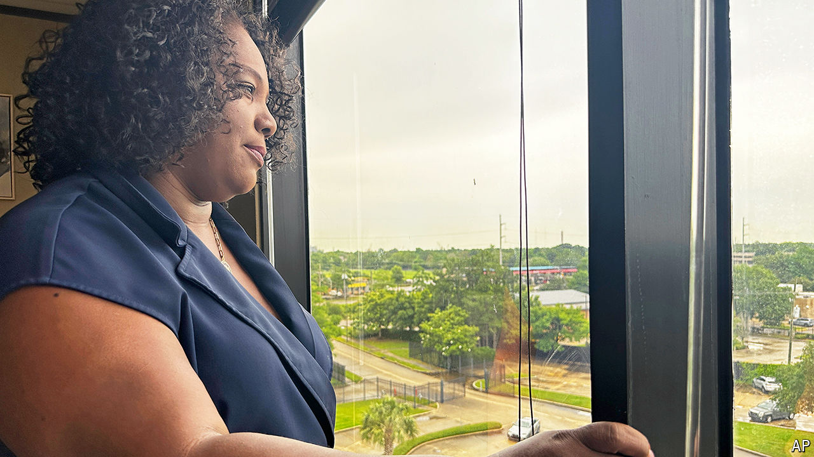

###### Surgical solution

# Louisiana could soon start castrating child-rapists 

##### Why two black Democrats pushed for one of America’s most alarming crime bills 

 

> Jun 13th 2024 

Delisha Boyd is the product of a rape. She reckons her mother was violated repeatedly from the age of 13, two years before she gave birth. Ms Boyd, a black Democratic state representative from New Orleans, told her story publicly for the first time when she introduced a bill to carve out rape and incest exceptions from Louisiana’s abortion ban in May of last year. “I can tell you today, in my mid-50s, that my mother never recovered from it. She was dead by the time she was 28 years old,” she said. The bill was voted down. 

This spring she told her story again at the state’s capitol in Baton Rouge, to buttress a starkly different proposal. Her new bill, co-authored with another Democrat, authorises judges to sentence child-rapists to surgical castration upon release from prison. Tough-on-crime Republicans lined up to support the bill, the first of its kind in America, while the legislature’s black caucus and most Democrats opposed it. It passed resoundingly and on June 4th was sent to the governor for sign-off. 

