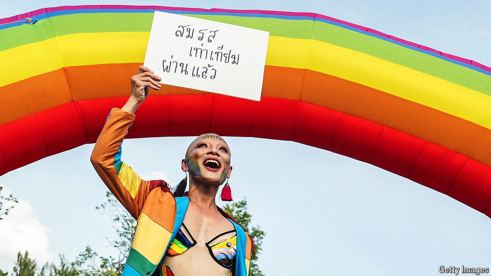

###### Marriage of equals

# Thailand legalises same-sex marriage 

##### It comes at a time when other freedoms are being curbed 

 

> Jun 20th 2024 

On June 18th government bigwigs, LGBT activists and stars of popular Thai television shows about gay love partied on the lawn in front of the prime minister’s offices in Bangkok. Hours earlier the Thai senate voted through a sweeping marriage-equality bill. Thailand will soon be the first South-East Asian country to legalise same-sex marriage.

The attendees, some of whom left the party in a motorcade of rainbow tuk-tuks, helped bring about comprehensive legislation. In Thailand’s civil code marriage will be described as a pact between two persons, rather than a man and a woman. Married LGBT couples will also get inheritance and adoption rights. The Thai king is expected to endorse the bill soon; it becomes law 120 days later.

