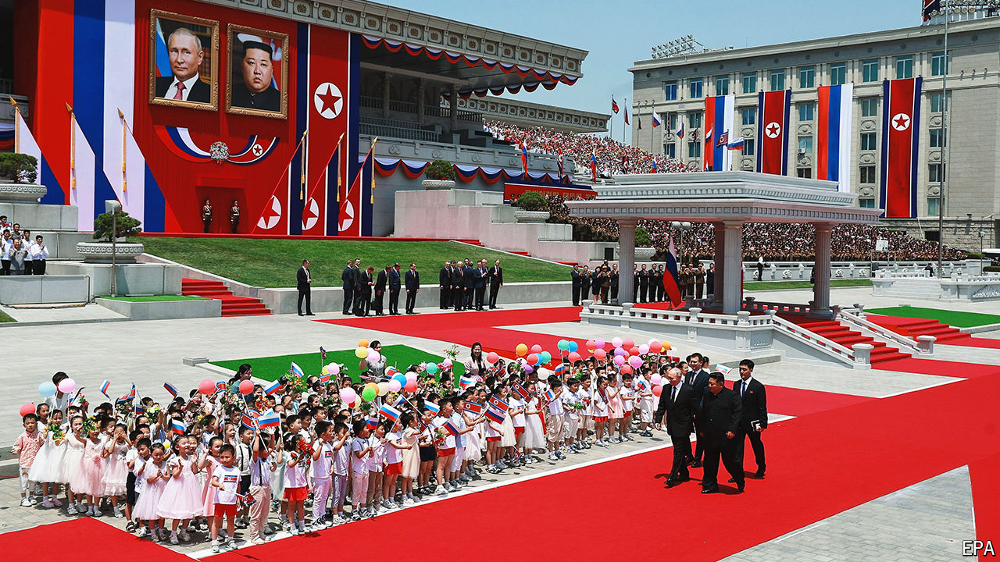

###### Marriage of convenience

# Vladimir Putin’s dangerous bromance with Kim Jong Un 

##### Russia’s dictator visits Pyongyang and signs a new strategic pact 

 

> Jun 16th 2024 

KIM JONG UN has a new best friend. Out is Donald Trump, who exchanged saccharine letters but  in 2019. In is Vladimir Putin, who has courted Mr Kim for  to fuel his war in Ukraine. Mr Kim has made two trips to Russia’s Far East to meet Mr Putin since 2019. On June 19th Mr Putin arrived in Pyongyang for his first visit since 2000, the year he made his debut as president. Though he landed at close to 3am local time, Mr Kim was waiting on a red carpet on the tarmac to meet him. The two leaders later signed a strategic partnership agreement, promising to come to each other’s aid when facing aggression. 

The  has blossomed thanks to geopolitical shifts. Mr Kim turned away from talks with America following the failed summit in Hanoi and began making fresh overtures to Russia. The response was lukewarm—until Mr Putin’s full-scale invasion of Ukraine floundered and Russia came to need munitions, one of the few things Mr Kim’s regime has in abundance. But the implications of the realignment go beyond the weapons trade. “It’s a mistake to think about it simply as an arms deal,” says Jenny Town of the Stimson Centre, an American think-tank. 

