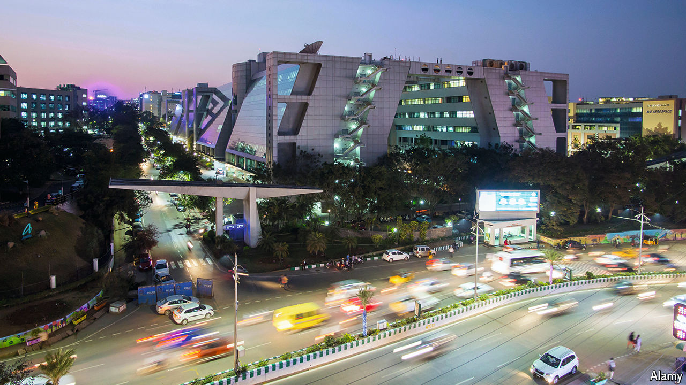

###### Governing 1.4bn people

# Why India should create dozens of new states 

##### The success of Telangana, the youngest, shows the benefits 

 

> Jun 20th 2024 

A decade ago the Union of India welcomed into the fold its newest member: the state of Telangana. Of India’s then 29 states, it ranked 12th by population, 11th by area and 10th by per-person income. One of those rankings has since changed dramatically. By last year Telangana had shot up to boast the highest per-person income of any decent-size state, behind only tiny Sikkim and Goa. 

That is not all. In the past decade the state’s GDP growth has outperformed India as a whole. With just 2.7% of India’s population, its share of the country’s annual output has increased nearly a fifth, to 4.8%. Hyderabad, its economic powerhouse, is a multilingual, multireligious metropolis with an abundance of high-tech jobs, including the largest Amazon office anywhere. Microsoft and Google are expanding their already substantial presence in the city. It is also a pharma hub. What is Telangana’s recipe for success?

