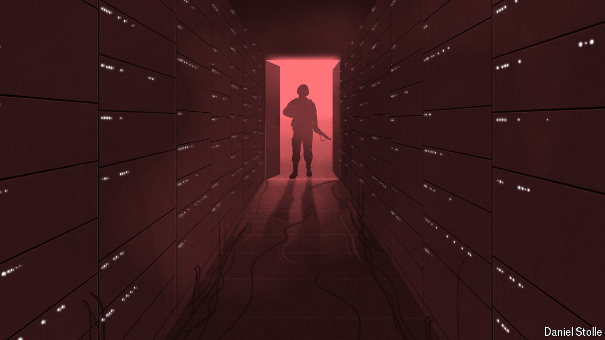

###### Model major-general

# How AI is changing warfare 

##### An AI-assisted general staff may be more important than killer robots 

 

> Jun 20th 2024 

IN LATE 2021 the Royal Navy approached Microsoft and Amazon Web Services, a pair of American tech giants, with a question: Was there a better way to wage war? More specifically, could they find a more effective way to co-ordinate between a hypothetical commando strike team in the Caribbean and the missile systems of a frigate? The tech firms collaborated with BAE Systems, a giant armsmaker, and Anduril, a smaller upstart, among other military contractors. Within 12 weeks—unfathomably fast in the world of defence procurement—the consortium gathered in Somerset in Britain for a demonstration of what was dubbed StormCloud. 

Marines on the ground, drones in the air and many other sensors were connected over a “mesh” network of advanced radios that allowed each to see, seamlessly, what was happening elsewhere—a set-up that had already allowed the marines to run circles around much larger forces in previous exercises. The data they collected were processed both on the “edge” of the network, aboard small, rugged computers strapped to commando vehicles with bungee cables—and on distant cloud servers, where they had been sent by satellite. Command-and-control software monitored a designated area, decided which drones should fly where, identified objects on the ground and suggested which weapon to strike which target. 

