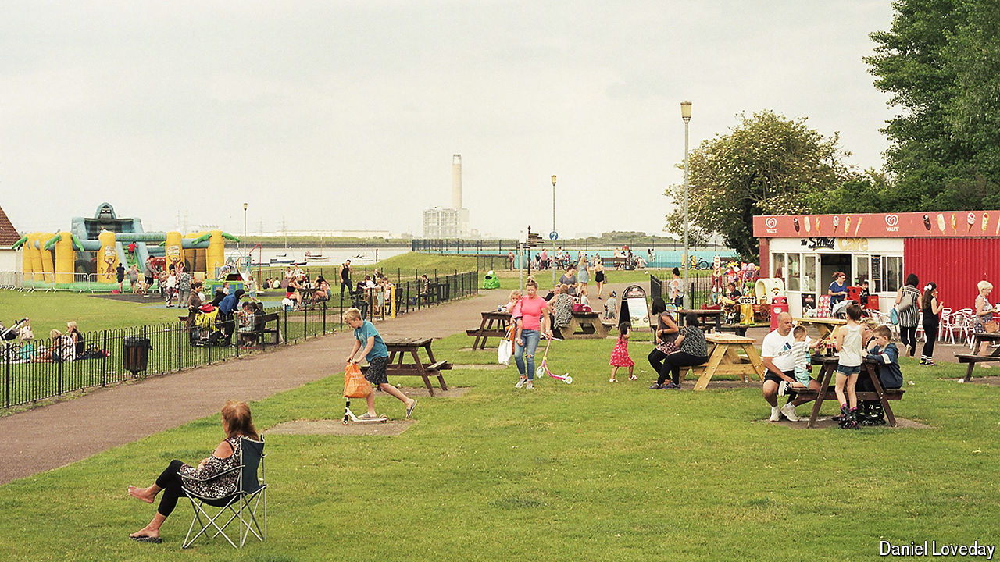

###### Britain’s general election

# Britain’s Conservatives rule the Thames Estuary. Not for long 

##### Our constituency poll in Gillingham and Rainham shows Labour on track for a thumping win 

 

> Jun 18th 2024 

On the evening of June 13th, St Margaret’s Church in Rainham was packed. At a long table in front of the altar, six would-be mps answered locals’ questions about schools, homelessness and the state of the high street. The Labour Party went through the church beforehand, putting leaflets on every pew, like orders of service. But despite the presence of so many voters and a tv camera, the Conservative candidate and sitting mp for Gillingham and Rainham, Rehman Chishti, did not turn up. He skipped another hustings four days later. If he loses the seat on July 4th, it will be partly for lack of trying. 

Sir Keir Starmer launched Labour’s election campaign in Gillingham, east of London in the Thames Estuary. He pronounced the name correctly (the first g is soft) and cracked a lame joke about the local football team. A  for  by WeThink suggests he will be amply rewarded. It puts Labour on 55%, the Conservatives on 23% and Reform uk, an anti-immigration party, on 15% (see chart). If there is a glimmer of hope for the Tories, it is that many undecided voters plumped for them in 2019.

