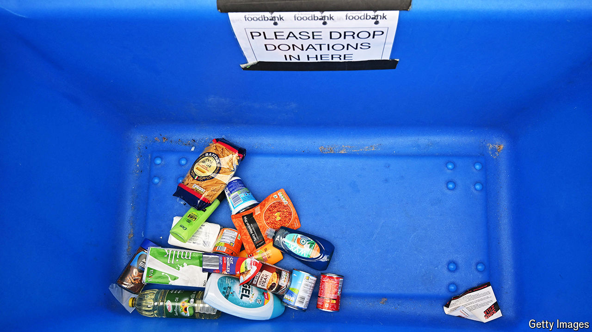

###### Expectation management

# Child poverty will be a test of Labour’s fiscal prudence 

##### Its MPs, members and voters will want rapid action on a totemic issue 

 

> Jun 20th 2024 

For a taste of the pressures that Labour will almost certainly soon be grappling with, watch a recent interview with Sir Keir Starmer on Sky News, a broadcaster. Pushed on how he would help families struggling with rising taxes and high energy bills, the Labour leader asked voters to trust his instincts: “It’s about who do you have in your mind’s eye?” The interviewer moved swiftly onto child poverty: could Sir Keir pledge to remove the two-child limit, which means families on benefits get no extra support beyond their second child? “I’m not going to make promises that I can’t keep,” he said. 

Sir Keir and his shadow chancellor, , have spent years building a reputation for fiscal prudence. As a result they now face the prospect of being elected by millions of voters they are bound to disappoint. Tackling poverty would not be the only let-down but it is a good case study of how a Labour government would struggle without money. There are few more urgent causes for the party’s core voters, many of whom work in public services and charities. It is the reason many activists and MPs—and several members of the shadow cabinet—got involved in politics. But the best the party can offer, at least for now, is modest change. 

