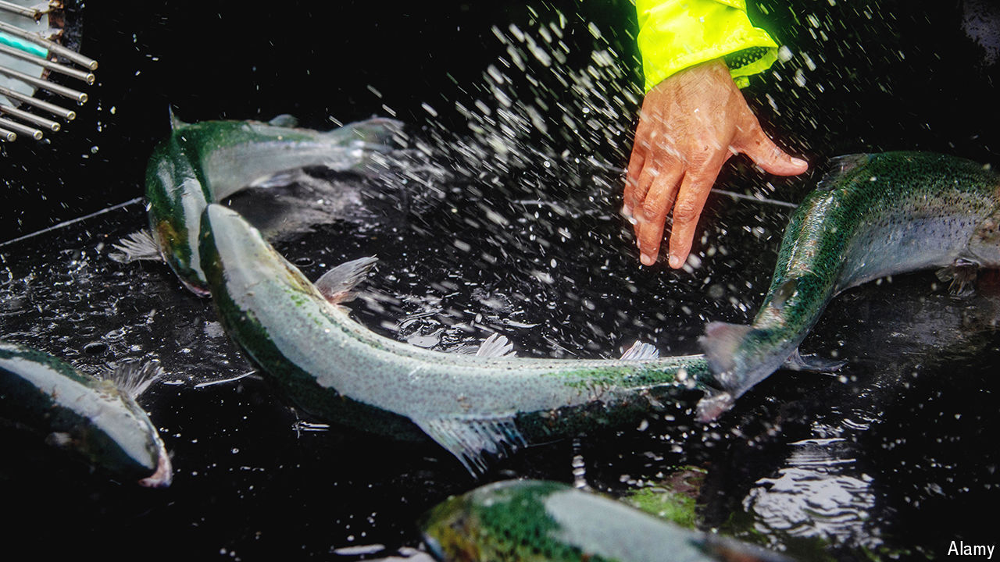

###### Death and salmon

# Climate change casts a shadow over Britain’s biggest food export 

##### Scottish salmon farms endure a rising mortality rate 

 

> Jun 17th 2024 

Spend time on the west coast of Scotland and it won’t be long before you spot them. Dotting the region’s lochs and bays, salmon farms are big business. Tourists and locals grumble that they spoil the views. But according to the Scottish government, the  is worth more than £1bn ($1.3bn) annually and supports around 12,000 jobs. Last year salmon—almost all of it reared in Scotland—was Britain’s biggest food export, well ahead of cheddar and lamb. 

Sir James Maitland, the eccentric owner of a Victorian hatchery in Stirlingshire, was probably the first Scot to breed the fish in captivity. (His recommended diet for salmon fry—horse meat and eggs—did not catch on.) But the industry took off only in recent decades. Technology from Norway, where the business was pioneered, combined with investment from Unilever, a consumer-goods firm, to yield Scotland’s first salmon harvest in 1971. Production has exploded. In 2016 Scotland produced twice as much salmon as it did in 1996; the brand has cachet worldwide.

