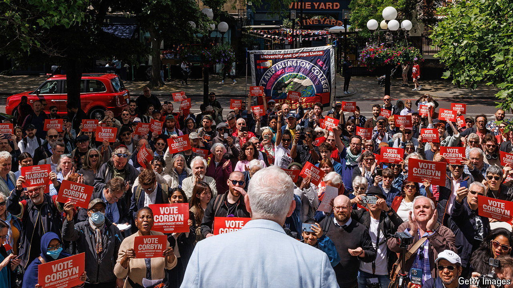

###### Oh, Jeremy Corbyn

# Jeremy Corbyn wants more nice things, fewer nasty ones 

##### The former Labour leader, and poet, goes canvassing 

 

> Jun 19th 2024 

Jeremy Corbyn is a good man. You can tell because he has a beard and sandals and he writes poetry. His writings brim with goodness. In his manifesto he preaches “compassion”, “peace”, “equality”, “democracy” and other nice abstract nouns. But he has a stern side: he does not like “injustice”, “cruel” things or “greed”. He is stalwart: such feelings have made him again run for election to be the MP for “the people of Islington North”, though presumably not for the greedy ones. 

Mr Corbyn used to stand not just for abstract nouns but also—though his manifesto falls a little quiet on this point—for the Labour Party, which he led between  and 2020. In that time he presided over not only Labour’s worst election defeat by number of seats since 1935 but also an alleged rise in , which critics felt smacked less of “equality” and “compassion” than of rather nastier things. Under his successor, Sir Keir Starmer, Labour first banned him from being a candidate and later booted him out of the party. In this election, Mr Corbyn is offering himself as an independent. He is also offering “hope”, for hope is “very precious”. Which is a little piece of poetry in itself.

