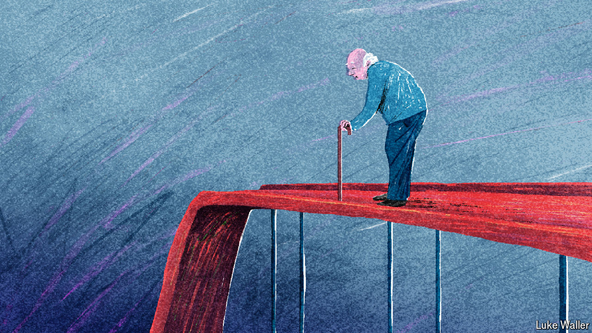

###### Without a care

# The silence of the bedpans 

##### Why is social care barely talked about in Britain’s election? 

 

> Jun 20th 2024 

IN 2016, 6% of over-65s in Britain received publicly funded long-term care. By 2023 this proportion had fallen to 5%. That is not because Britons are getting healthier. Quite the opposite. Local councils, which fund social care only for those with the greatest need and the fewest assets, have faced real-terms cuts of 18% per person to their budgets since 2010. Less than half of the elderly who need care receive any support; overcrowded hospital wards in the National Health Service (NHS) end up taking much of the strain. 

Some politicians have made efforts to fix the problem. The last prime minister but one, Boris Johnson, deserves rare credit for introducing a health and social-care levy to raise money for the ailing sector. He also pledged a cap on the costs of care that people bear for themselves—one in seven over-65s face bills of more than £100,000 ($126,700). But in this election,  is conspicuous mainly by its absence. 

