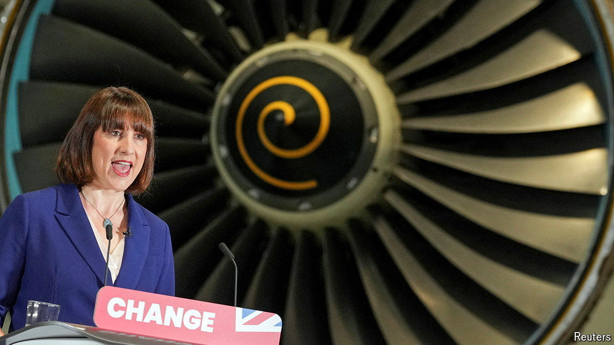

###### Filling the fiscal hole

# What taxes might Labour raise? 

##### Growth alone will not fix Britain’s public finances 

 

> Jun 20th 2024 

To win big in general elections, the Labour Party needs to convince fretful voters that it can be trusted with the economy. Clement Attlee sold post-war nationalisations with the mien of a staid bank manager. Ahead of the party’s landslide win in 1997, New Labour pledged to copy years of restrictive Tory spending targets. Rachel Reeves, the shadow chancellor, has adopted a similar tactic ahead of Labour’s widely expected election win on July 4th. 

Barring a few titbits of extra spending—worth around £10bn ($12.7bn, or 0.4% of GDP) annually and funded by taxes on private schools, home purchases by foreigners and the like—she wants to stick to plans set out by Jeremy Hunt, the chancellor, in March. She has also committed herself to the  that government debt must be projected to fall as a share of GDP in the fifth year of five-year forecasts from the Office for Budget Responsibility (OBR), a watchdog.

