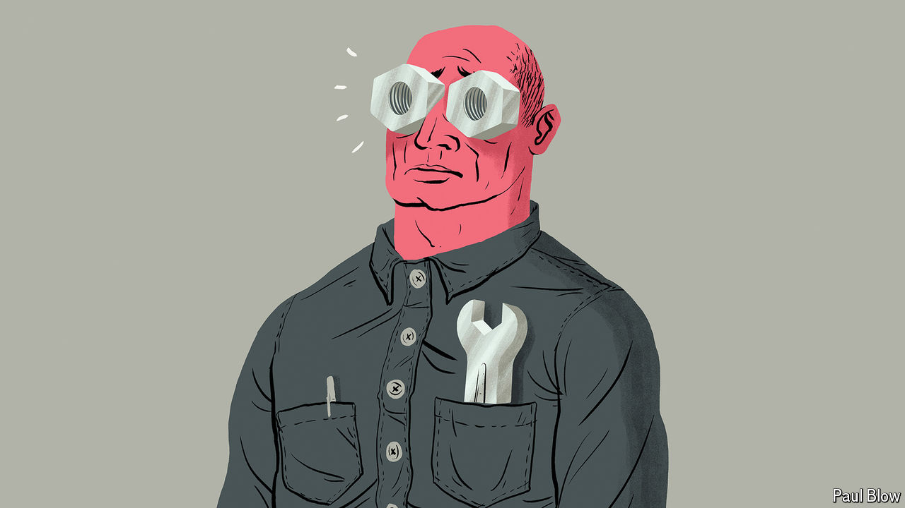

###### Bartleby

# Are manufacturing jobs really that good? 

##### The nostalgia of politicians is misplaced 

 

> Jun 20th 2024 

If there is one thing politicians agree on these days, it is that manufacturing jobs are “good” jobs. Joe Biden is betting that huge subsidies for new factories will transform the outlook for America’s workers—and November’s election. His acting labour secretary recently embarked on a jolly-sounding “Good Jobs Summer Tour” to trumpet the president’s plans. Donald Trump, Mr Biden’s rival, is just as eager to get more wrenches into the hands of American workers, mostly by slapping tariffs on foreign goods. Politicians across the rich world believe that reversing the decades-long decline in manufacturing employment would leave workers better off.

Your guest Bartleby is not convinced. He has, admittedly, never worked in a factory, and thus feels no nostalgia for hard hats and high-vis vests. Still, the idea that deindustrialisation has made work worse is hard to square with the fact that data on worker satisfaction have been steadily improving for years.

