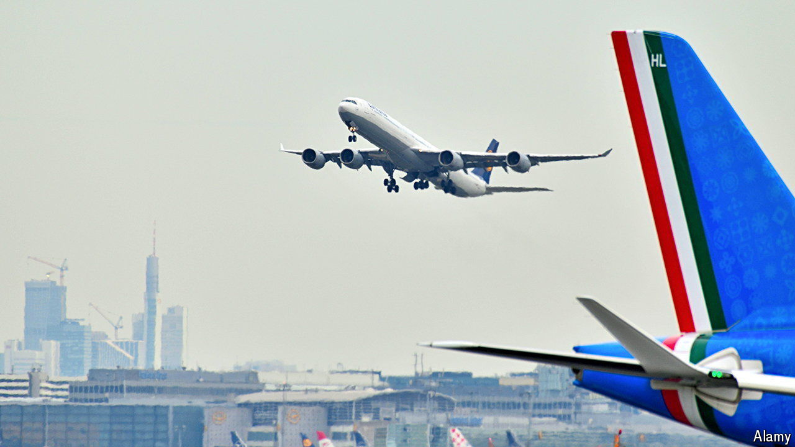

###### Flying off the rails

# European airlines are on a shopping spree 

##### Lufthansa and IAG are pursuing big acquisitions 

 

> Jun 20th 2024 

Some corporate tie-ups delight investors. Others make them groan. The purchase of a 41% stake in ITA, Italy’s national airline, by Lufthansa, a German carrier, for €325m ($350m) is an example of the latter. Rumours that the EU is close to blessing the deal have contributed to a slump in Lufthansa’s share price. 

ITA, once called Alitalia, is hardly a crown jewel. Since its founding in 1946 it has turned an annual profit only three times. The Italian government privatised the company in 2009—then renationalised it in 2020, rebranding it as ITA in the hope of a fresh start. Air France-KLM and Etihad, two airline businesses that had taken minority stakes in the carrier, wrote off their investments. The Italian government spent around €3.5bn during the covid-19 pandemic to keep the company aloft, equivalent to roughly €300,000 per employee.

