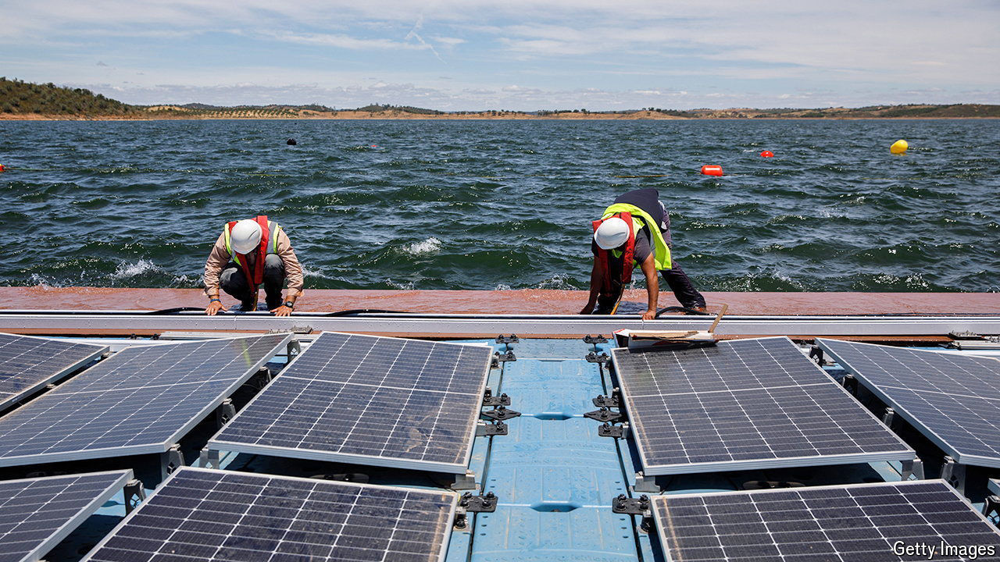

###### Dam good

# Floating solar has a bright future 

##### The technology is now ready to shine 

 

> Jun 20th 2024 

Drive a few hours from Lisbon towards Spain, past the olive farms, and you will arrive at Europe’s largest artificial lake, at the Portuguese town of Alqueva. The first thing that catches the eye is the large hydroelectric dam. But look closer and you will also spot a bright patch of floating glass. It is the floating solar-power plant built by EDP, a Portuguese utility that is one of the world’s biggest developers of renewable energy. Critics have long dismissed such projects as a costly and trouble-prone experiment. The technology, however, is now ready to shine.

In this first phase of the project at Alqueva, engineers have stationed some 12,000 photovoltaic (PV) modules on floating pontoons made from partially recycled plastic and locally sourced cork. These are connected to an energy-storage system incorporating lithium-ion batteries and integrated with the hydroelectric dam’s power station.

