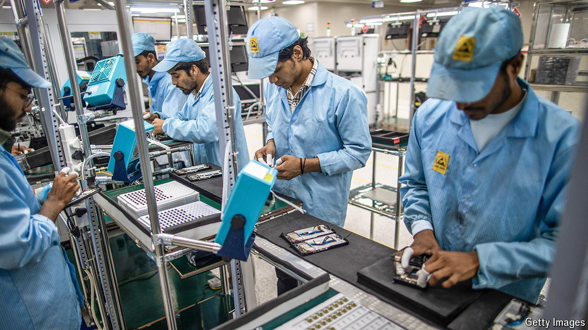

###### Powering up

# India’s electronics industry is surging 

##### Foreign and domestic firms are investing in local manufacturing 

 

> Jun 20th 2024 

To witness India’s growing role as a manufacturing hub, dodge Bangalore’s notorious traffic and head north. Around 45km outside the city, amid the dust and debris of construction, Foxconn, a Taiwanese contract manufacturer, is turning 120 hectares of farmland into a factory that will produce around 20m iPhones a year. Foxconn’s plant will be the third facility near Bangalore dedicated to churning out phones for Apple, an American tech giant. The other two are run by Tata, India’s largest conglomerate.

Bangalore, home to many of India’s IT giants, is better known for its software than its hardware. However, the new factories suggest that, in one industry at least, India’s efforts to transform itself into a manufacturing powerhouse are bearing fruit. Electronics manufacturing—the business of building mobile phones, televisions and other gadgets—is thriving in India. The value of electronics it produced rose from $37bn to $105bn (3% of GDP) between the fiscal years ending in March 2016 and March 2023 (see chart). The government wants to triple this again by fiscal 2026. Although India’s production of electronics accounts for just 3% of the global total, its share is growing faster than any other country’s.

