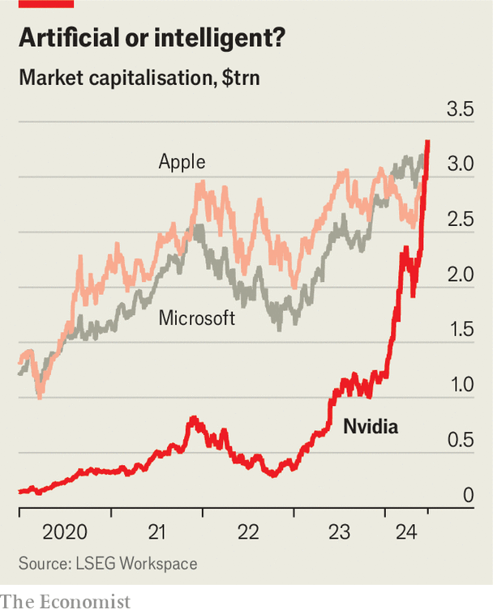

###### Nvidia

# Nvidia is now the world’s most valuable company 

##### Tech giants can’t get enough of its chips 

 

> Jun 20th 2024 

 


On June 18th Nvidia overtook Microsoft as the world’s most valuable company. Its market capitalisation of $3.3trn is more than 20 times what it was in January 2020. Investors are buying its shares as greedily as tech giants are buying its artificial-intelligence chips. Nvidia’s revenue in the quarter ending in April rose by 262%, year on year. Its net income rose by 628%.■

