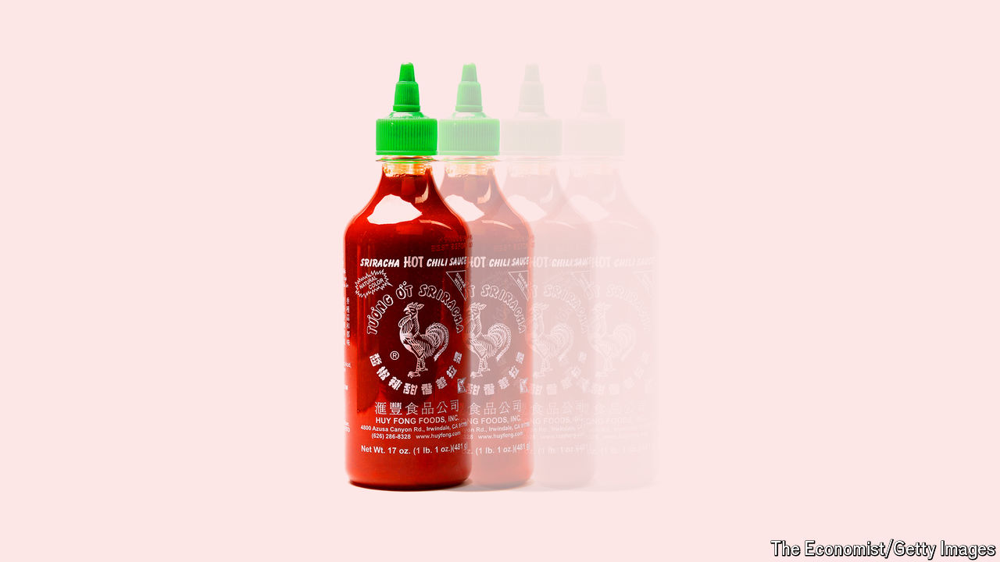

###### Hot mess

# The cautionary tale of Huy Fong’s hot sauce 

##### What went wrong for America’s favourite sriracha brand? 

 

> Jun 20th 2024 

Sweet and spicy with a sour tinge, sriracha sauce was an instant hit when David Tran, a Vietnamese refugee, brought it to America in the 1980s under the brand Huy Fong Foods. Asian eateries were the first to snap up Mr Tran’s hot sauce, but before long the green-nozzled bottle, with its distinctive rooster logo, had become a staple in restaurants and pantries alike. Within just a few years Mr Tran went from hawking his wares out of a Chevy van in Los Angeles to walking the floor of a 20,000-square-metre factory. By 2020 his business was worth $1bn.

Since then, however, it has suffered a meltdown. First came grumblings by fans that the condiment had lost its vibrant crimson colour and peppery punch. Next came the shortages. Enthusiasts soon panicked and began to hoard the stuff. At one point last year resale prices for Huy Fong’s sauce on eBay, an e-commerce site, reached as high as $150 per bottle. To cap it off, last month the company announced it was halting production until at least September.

