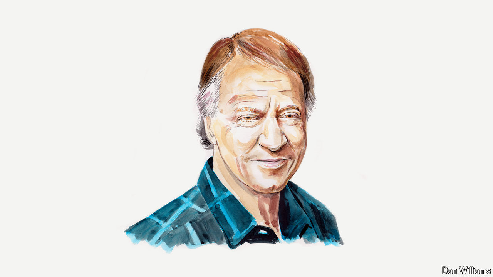

###### Artificial intelligence

# Ray Kurzweil on how AI will transform the physical world 

##### The changes will be particularly profound in energy, manufacturing and medicine, says the futurist 

 

> Jun 17th 2024 

BY THE TIME children born today are in kindergarten, artificial intelligence (AI) will probably have surpassed humans at all cognitive tasks, from science to creativity. When I first predicted in 1999 that we would have such artificial general intelligence (AGI) by 2029, most experts thought I’d switched to writing fiction. But since the spectacular breakthroughs of the past few years, many experts think we will have AGI even sooner—so I’ve technically gone from being an optimist to a pessimist, without changing my prediction at all.

After working in the field for 61 years—longer than anyone else alive—I am gratified to see AI at the heart of global conversation. Yet most commentary misses how large language models like ChatGPT and Gemini fit into an even larger story. AI is about to make the leap from revolutionising just the digital world to transforming the physical world as well. This will bring countless benefits, but three areas have especially profound implications: energy, manufacturing and medicine.

