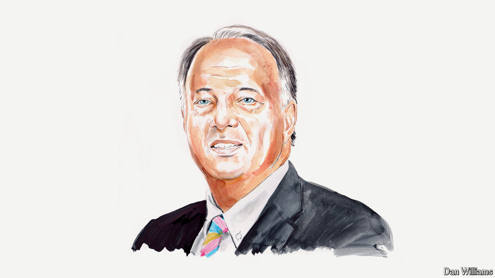

###### Russia and the West

# Vladimir Putin’s war against Ukraine is part of his revolution against the West 

##### He is leading Russia into a new phase of strategic confrontation, says Stephen Covington, a longtime NATO adviser 

 

> Jun 20th 2024 

WHEN VLADIMIR PUTIN invaded Ukraine in 2022, many Western observers thought it a temporary regional crisis that ultimately would settle into a frozen conflict. Two and a half years later, this view is challenged by a more consequential reality.

The Russian leader’s goal is not just to break Ukraine and stop its quest for a place in the family of Western democracies, but to dismantle the American-led security system that emerged after the second world war. In that sense Mr Putin is fomenting a revolution: using the strategy and tactics of revolution against the Western system. His war against Ukraine is inextricably linked to the strategic objective of his revolution.

