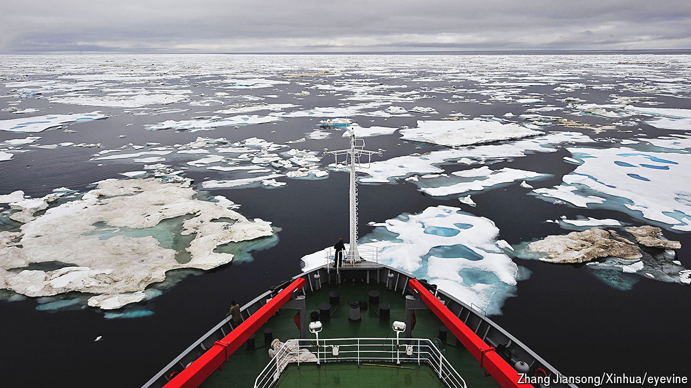

###### Picking through the ice

# China and Russia have chilling plans for the Arctic 

##### The two autocracies dream of creating a “polar silk road” 

 

> Jun 19th 2024 

Four hundred kilometres north of the Arctic Circle, in the Norwegian port of Kirkenes, there are still some who dream that this sleepy town will one day become an important shipping hub. They see it as the western end of a new, faster sea route from China to Europe, made possible by the impact of global warming on ice-filled waters off the Siberian coast. With war raging in Ukraine, this ambition now sounds fanciful. China’s support for Russia is fuelling Western distrust of the Asian power’s “polar silk road” plans. But China is not retreating from the Arctic. It still sees a chance to boost its influence there, and to benefit from the area’s wealth of . 

Rising temperatures in the Arctic are slowly opening up  for transport. But geopolitics are changing the region faster. Kirkenes feels this strongly. It is just 15 minutes’ drive from the Russian border. Tourists can enjoy a “king crab safari” that takes them by boat right up to it, with eponymous crustaceans caught along the way and cooked for the visitors (the massive non-native species was introduced by the Soviets). Russians, though, no longer cross into Kirkenes for shopping and crab feasts. On May 29th Norway closed the border crossing to day-trippers from the other side. The conflict in Ukraine has cast a chill over the town. There were “tensions in the air” in October when Russia’s envoy in Kirkenes laid a wreath at a monument to the Soviet troops who liberated the town from the Nazis towards the end of the second world war, the , a local online newspaper, reported. Politicians in Kirkenes had urged him not to do so. 

