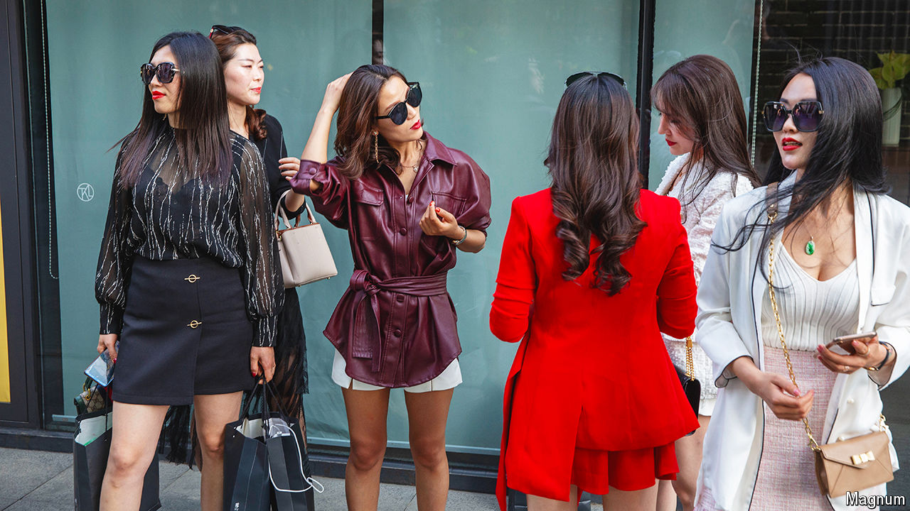

###### Leave the Hermès at home

# China doesn’t want people flaunting their wealth 

##### Especially not on the internet 

 

> Jun 20th 2024 

MAO ZEDONG persecuted the rich. But his successor as paramount leader, Deng Xiaoping, decided to “let some people get rich first”, as he launched market-oriented reforms. Now a growing number of Chinese are rich—and the pendulum has swung back, with the government cracking down on ostentatious displays of wealth.

Online influencers are the state’s main target. Until recently, these (mostly young) men and women flaunted their luxury goods to millions of followers. In recent months, though, many have had their social-media accounts suspended by China’s internet regulators.

