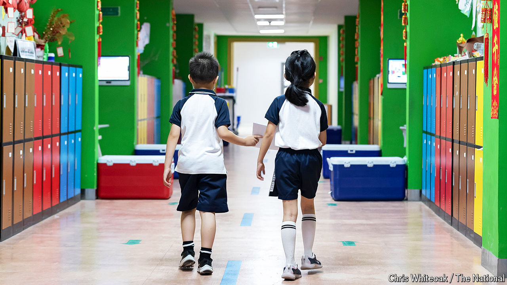

###### School spirit

# China wants to export education, too 

##### It sees international schools as a service to expatriates—and a source of soft power 

 

> Jun 20th 2024 

ABOUT 500 pupils study at the Chinese School Dubai. Most are children of Chinese expatriates who have moved to the United Arab Emirates for work. At the school’s swish suburban campus, pupils follow much the same curriculum they would at home. On one wall hangs a bland quote from China’s leader, Xi Jinping, picked out in shiny gold. The institution, which has more than doubled in size since its opening in 2020, is a pilot project: the first of several international schools the Communist Party talks of setting up in big cities. In 2019 officials said they had asked Chinese diplomats in 45 countries, including Britain and America, to explore the possibility of creating such institutions.

American, British and French schools are easy to find in most big capital cities. But ones that teach the Chinese curriculum remain sparse, even though more than 10m Chinese nationals are thought to live abroad. The government fears this is discouraging Chinese from working for its companies overseas. Children who swap domestic classrooms for foreign ones, even for a bit, can struggle when they go back to China. That mattered less when high-fliers all clamoured for spots in Western universities (which are best won with Western qualifications). But clever kids are increasingly competing for places in , so they seek out Chinese credentials.

