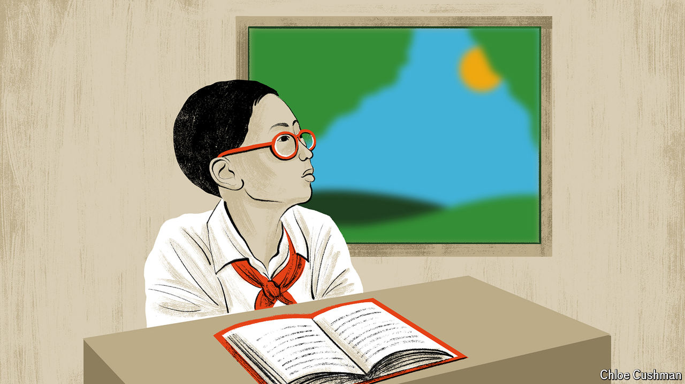

###### Chaguan

# China’s revealing struggle with childhood myopia 

##### Anxious parents don’t want to let children play outdoors and do less schoolwork 

 

> Jun 20th 2024 

NO ETHICS committee would let researchers trap millions of children indoors for months, just to test the effects on their eyesight. Yet China’s strict zero-covid rules—notably a nationwide lockdown that closed many schools between January and May 2020, leaving children studying online with few chances to leave their homes—created just such a natural experiment.

The results are in and they are “dramatic”, says Lan Weizhong, an ophthalmologist at Central South University in Changsha. After pandemic lockdowns ended, mass eye tests in several Chinese cities detected spikes in rates of childhood myopia, or fuzzy sight at a distance. That confirms the widely held scientific belief that the healthy growth of young eyes is impeded by too much “near work”, including time spent reading books or watching screens, and by a lack of time outdoors, says Professor Lan. 

