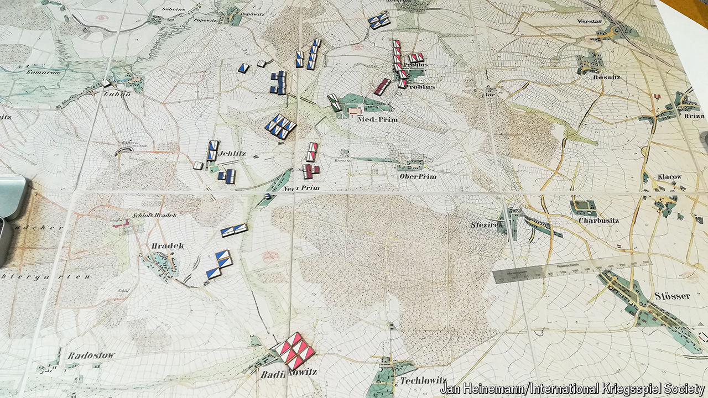

###### Everything to play for

# How games and game theory have changed the world 

##### A provocative history of gaming’s influence calls for a change in the rules 

 

> Jun 20th 2024 

By Kelly Clancy. 

In 1824 Prince Wilhelm of Prussia asked for a demonstration of an elaborate game he had heard about from his military tutor. The , or war game, had been devised a few decades earlier as a more militarily realistic form of chess. Instead of regular squares, the board was a detailed map of a real battlefield. Wooden blocks represented different military formations; each turn of the game simulated two minutes of battlefield combat. Damage was worked out by rolling special dice and using odds-based scoring tables based on casualty statistics from historical battles. The game took two weeks to play, during which all cats had to be banished from the vicinity, so they did not climb on the board and mess up the pieces. 

