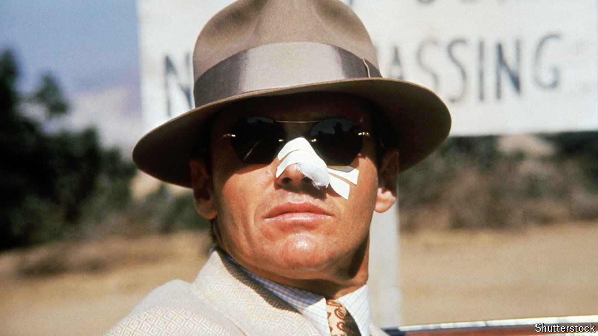

###### No city of angels

# Los Angeles is the capital of film noir 

##### 50 years after “Chinatown”, the city is still inspiring new takes on the genre 

 

> Jun 20th 2024 

“MIDDLE OF A drought and the water commissioner drowns,” the mortician remarks drily to Jake Gittes, a private investigator played by Jack Nicholson (pictured): “Only in LA.” Indeed. June 20th marks the 50th anniversary of the release of “Chinatown”, the film truest to the Los Angeles of the countless noirs set in America’s second-most-populous city. Other films revolve around Hollywood—or at least its dark, gritty edges—where every millionaire, wannabe actor and insurance agent has a secret worth killing for. But Gittes was fixated on water, or the lack thereof, a perennial problem in a city that is otherwise constantly changing. 

Film noir was so named by French critics after the second world war. It is a style of film-making that often features a cynical anti-hero who either sleuths for a living or finds himself accidentally drawn into an investigation. Think of Humphrey Bogart as Philip Marlowe in “The Big Sleep” (1946), a film based on Raymond Chandler’s novel. Or of Barton Keyes, an insurance claims investigator, hellbent on sniffing out fraud in “Double Indemnity” (1944). There is a good chance that crooked cops, cover-ups, pretty blondes and business tycoons will turn up at some point in the story. The closest thing to a happy ending is that not everyone will end up dead. 

