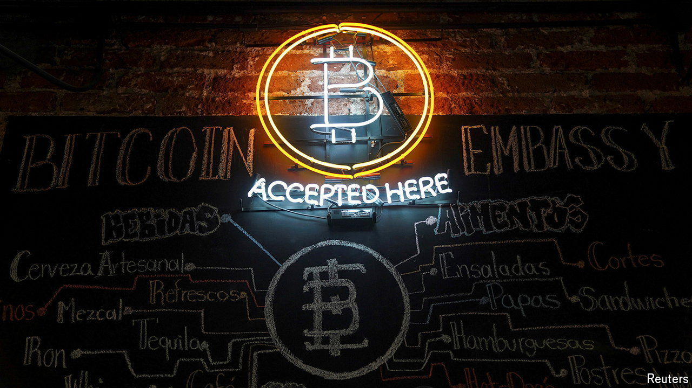

###### When screens clean the green

# Technology has changed money-laundering 

##### This will confound government enforcers for years to come 

 

> Jun 20th 2024 

 By Geoff White. 

ON JUNE 2nd Bill Guan, the chief financial officer of the , a right-wing newspaper, was arrested. Prosecutors in New York charged him with laundering $67m, allegedly buying pre-paid debit cards using cryptocurrency. (Mr Guan has pleaded not guilty.) Chainalysis, a blockchain-analysis firm, estimates that $22.2bn in illicit funds were laundered globally using cryptocurrencies in 2023. Despite Western sanctions, Iran, North Korea and Hamas, a terrorist group, all launder funds with crypto. 

