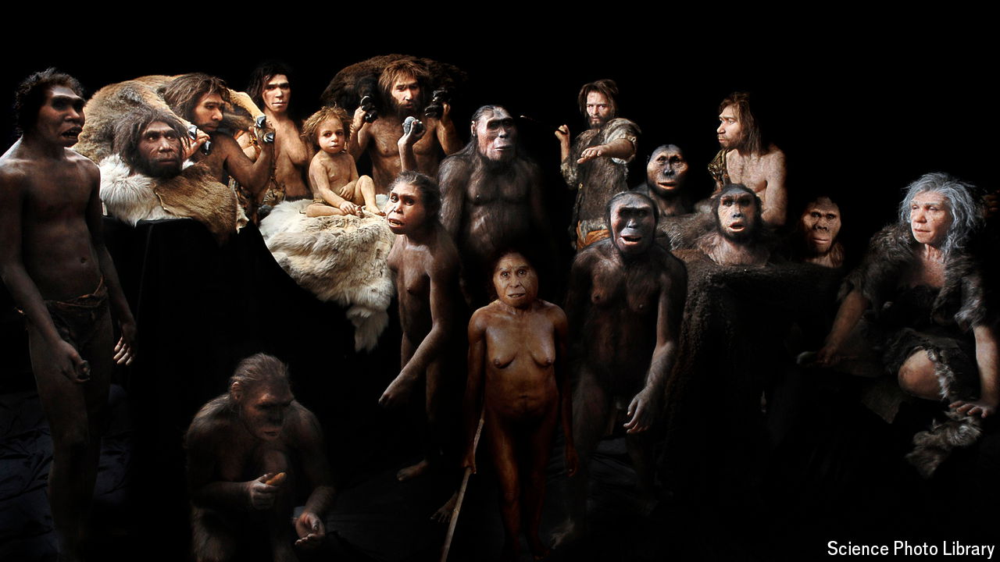

###### Who are you calling a Neanderthal?

# Theories of pre-history are a mirror on their times 

##### What humans’ perspective on the past says about them 

 

> Jun 20th 2024 

 By Stefanos Geroulanos. 

THERE IS NO doubt that the past can shape the future in profound ways: consider climate change, for instance. It is also true that imagined pasts can influence real-world events. Vladimir Putin invokes history to justify his invasion of Ukraine, picturing it as a child that was snatched from Mother Russia and should be returned. Ukrainians see things differently. This clash of visions underpins the bloodiest war in Europe since 1945.

