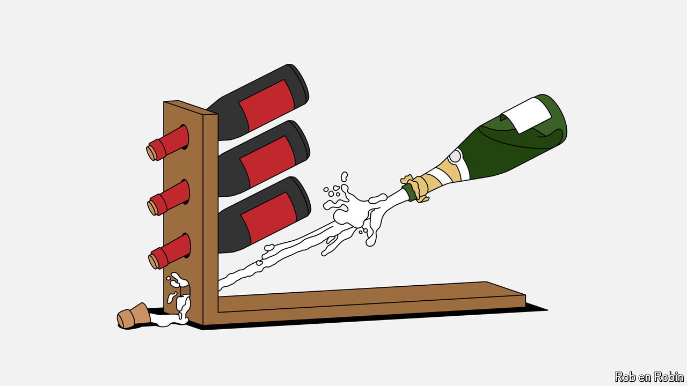

###### Bottles up

# Wine collectors are at last taking champagne seriously 

##### Prices have, in turn, been bubbly 

 

> Jun 20th 2024 

NAPOLEON BONAPARTE was a champagne enthusiast. He became friends with the heir to Moët &amp; Chandon, now the world’s largest seller of French bubbly, while studying at a military academy. Later, as emperor, Napoleon stopped in Épernay on his way to, and back from, war. “In victory, you deserve champagne; in defeat, you need it,” he said. 

Champagne now merits its own victory tour. The value of sales of champagne hit €6.4bn ($6.9bn) in 2023; 2021-23 were the best years on record, even after accounting for inflation (see chart). Over the past five years the “Champagne 50” index, which tracks the value of the top brands traded on Liv-ex, a wine-buying platform, has surged by 47%, more than any other regional index worldwide, including Bordeaux (up by 1.3%), Burgundy (25%) and Italy (29%). In the past half-decade the  has published more articles and reviews devoted to champagne than it did in the preceding 41 years since its founding, says William Kelley, the editor-in-chief. (Bottles can bear the “champagne” name only if they hail from that region of north-eastern France near Épernay.) 

