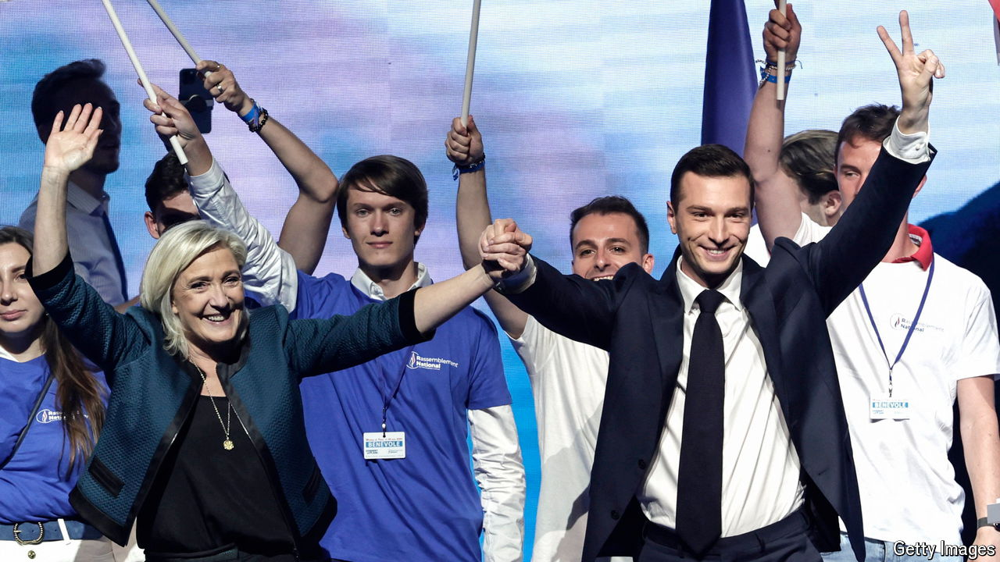

###### The French parliamentary elections

# A hard-right 28-year-old could soon be France’s prime minister 

##### Jordan Bardella is poised, social-media savvy and enigmatic 

 

> Jun 17th 2024 

A DECADE AGO Jordan Bardella was a mere teenager, spending hours after school firing at enemy combatants on “Call of Duty” video games. Today the 28-year-old leader of the  may be weeks away from becoming prime minister of France, and its youngest ever by a long way. After a two-round legislative election on June 30th and July 7th, his party could win enough seats to form a government. The ascent of Marine Le Pen’s young protégé from obscurity to the cusp of high office is one of the more improbable in modern French politics.

The son of an Italian-born mother and a father whose family arrived in France from Italy, Mr Bardella grew up in social housing in Seine-Saint-Denis, a multicultural northern  (suburb) of Paris. What could have held him back in life became his political selling-point. “I have my roots there, a part of myself and my family’s history,” Mr Bardella told , recalling the drug dealers that hung out on a battered sofa on the landing outside his flat. “I’m in politics for everything that I lived through back there.”

