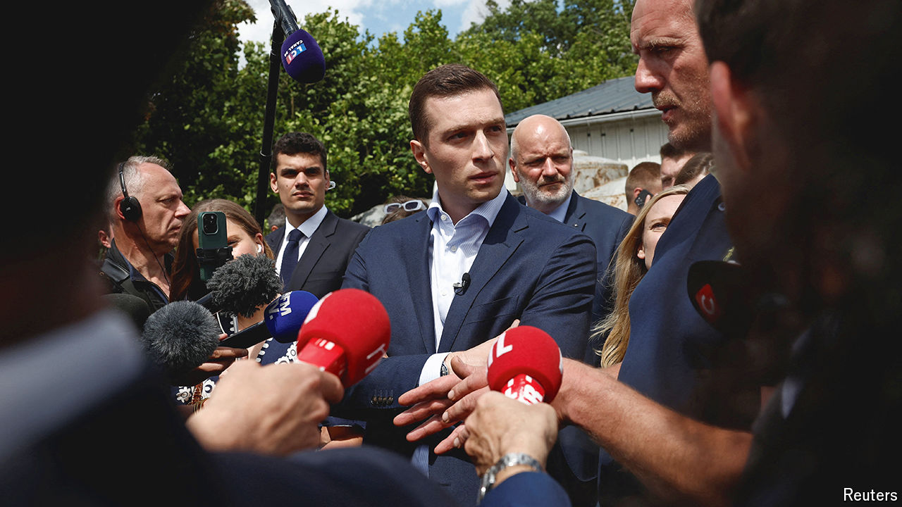

###### France’s parliamentary election

# Emmanuel Macron faces heavy losses after a short campaign 

##### The next French government may be led by the hard right or hard left 

 

> Jun 20th 2024 

As France’s flash parliamentary-election campaign officially got under way this week, Emmanuel Macron’s centrist candidates were pounding the streets, trying to put on a brave face. After days handing out flyers, one deputy standing for re-election concedes that campaigning is “extremely tough”. Another describes the president’s  to call a snap legislative election as “idiotic”. Many are preparing to pack their bags. “He has thrown us under a bus,” says a minister.

The two-round vote for the National Assembly, on June 30th and July 7th, has turned into one of the most crucial in post-war French history. At stake is the serious possibility of a government led by either the hard right or hard left. Marine Le Pen’s National Rally (RN) is the better known. But the reconstituted left-wing alliance, the New Popular Front (NFP), is now hot on its heels, with an equally drastic tax-and-spend programme.

