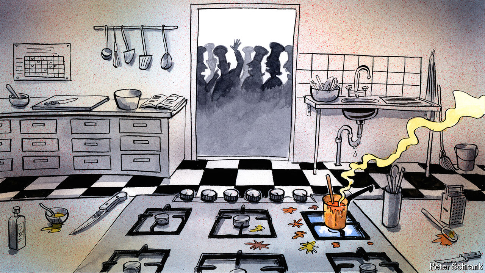

###### Charlemagne

# Europe today is a case of lots of presidents yet nobody leading 

##### Your cut-out-and-keep guide to people who no longer matter in the EU 

 

> Jun 20th 2024 

For several years in the early 1990s Deng Xiaoping ran China despite having no formal title other than Most Honorary President of the Chinese Bridge Association. The European Union today is roughly the opposite: a place crawling with presidents, yet nobody in charge. An unexpected power vacuum has befallen the continent in the midst of ongoing war, a budding trade spat with China and a nerve-jangling election in America. Whether in Brussels or in national capitals, those on hand are otherwise engaged, usually with their own domestic difficulties. Can someone—anyone—step up to lead Europe?

It has long been hard to work out whom to call if you want to speak to Europe. But that is in fact one of its charms. In centuries gone by, establishing who had the upper hand on the continent used to involve gauging whose troops had made the furthest inroads into its neighbours’ territory (Germany, often). After the second world war, when fighting gave way to EU meetings convened to discuss the format of future EU meetings, the question of “Who runs Europe?” usually gave rise to a cacophonous answer. Federalists like to think it is the leaders of the bloc’s main institutions in Brussels. Brits always suspected it was the Franco-German axis, which they never managed to crack. The French think the EU is led by, , the French; Germans stand knowingly in the corner, happy to let them believe it. Nationalist types like Viktor Orban of Hungary or Giorgia Meloni of Italy are quite sure their time has come, given a recent rightward shift in European elections. Members of the European Parliament are adamant it should be them. The correct answer is in permanent flux, keeping Brussels-based journalists gainfully employed.

