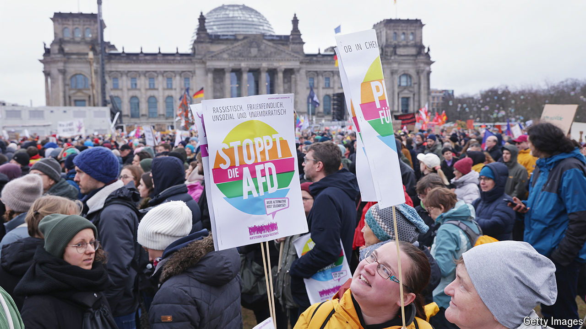

###### Crumbling firewalls

# Hard-right parties are entering government across Europe 

##### Germany is among a dwindling number of holdouts 

 

> Jun 20th 2024 

IN 2000 AUSTRIA’S conservatives invited the Freedom Party (FPÖ), a hard-right outfit with Nazi roots, into government—and opprobrium onto their own heads. Other eu governments suspended contacts. Scientific and artistic boycotts were mooted. Louis Michel, Belgium’s foreign minister, urged his compatriots to snub Austria’s ski slopes.

How quaint it seems now. When Mr Michel’s son Charles, who presides over the European Council, scans the table at the eu summits he chairs, he sees eight leaders from right-wing populist parties or dependent on their support. Many of the 19 other countries have had a similar experience, or could soon face it (Austria among them; the FPÖ may rejoin government after an election in September). The  is fraying even at EU level. Mr Michel’s counterpart at the European Commission, Ursula von der Leyen, has flirted with the Brothers of Italy, a post-fascist party, in her bid for a second term. 

