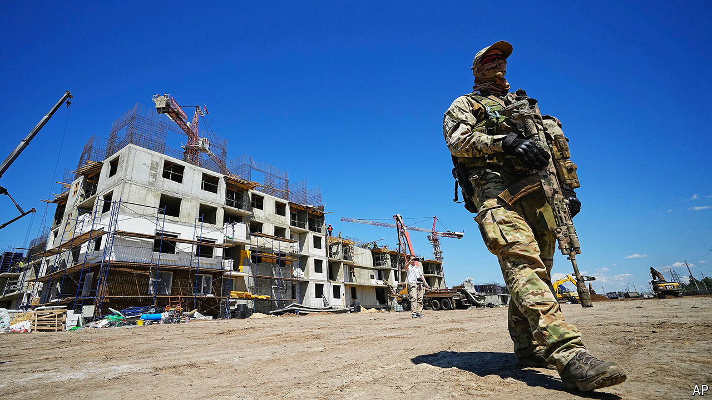

###### The spoils of war

# Russia’s latest crime in Mariupol: stealing property 

##### It is seizing homes in order to consolidate control 

 

> Jun 19th 2024 

OVER THE past few months, little white notices have appeared on doorways to residential blocks all over Mariupol, a city besieged, wrecked and then seized by Russia in May 2022. “An inventory of your block will be carried out to identify ownerless property; the owner of the apartment should be at home with documents and a Russian passport.” The print is small, the implications large. Unless the apartments are re-registered with the Russian occupying authorities and people are living in them, the properties will soon be declared ownerless and sold. 

Petro Andryushchenko, an adviser to the Mariupol municipal authority in exile, says he knows his apartment has been broken into and his possessions stolen. Like many of the other roughly 350,000 Mariupolans from a pre-war population of 430,000 who have fled, he cannot risk going back to re-register his flat in person. He expects someone else will soon be living there. “It’s a normal story,” he says. 

