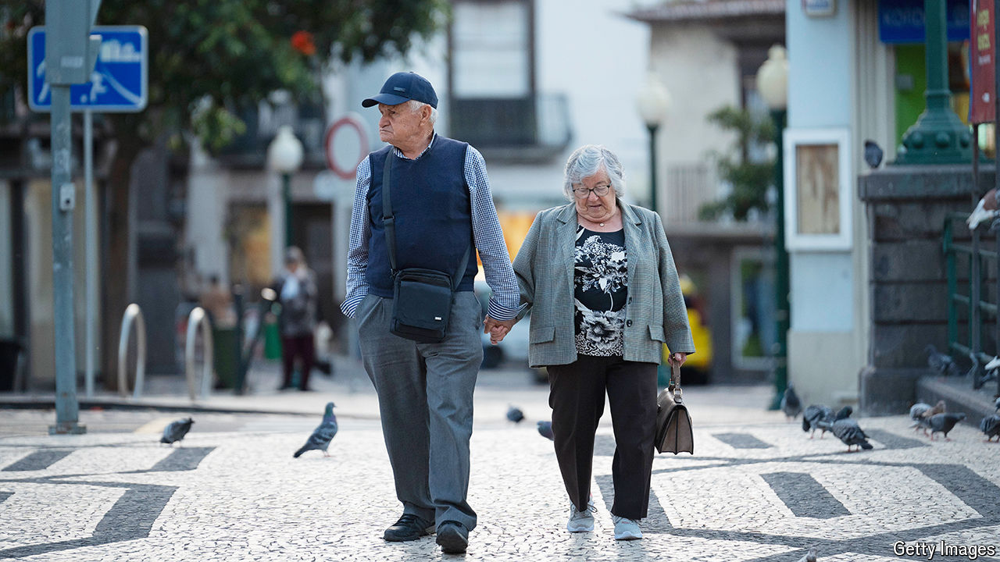

###### Growing old together

# Why southern Europeans will soon be the longest-lived people in the world 

##### Diet and exercise, but also urban design and social life 

 

> Jun 20th 2024 

The Calle de Jordán, a short street in central Madrid, encompasses the entire cycle of human life. On one block is a fertility clinic, an increasingly common sight in a country obsessed by its shortage of babies. A block further down is a day centre for pensioners, advertising services like memory training and help with mobility. It is common to see women in their 60s gently leading their 90-something mothers up to the door.

The Institute for Health Metrics and Evaluation at the University of Washington recently issued projections for longevity by country in 2050. Among the top 20 for living to a ripe old age are rich ones like Switzerland and Singapore. East Asia is also represented by South Korea and Japan, longtime longevity leaders.

