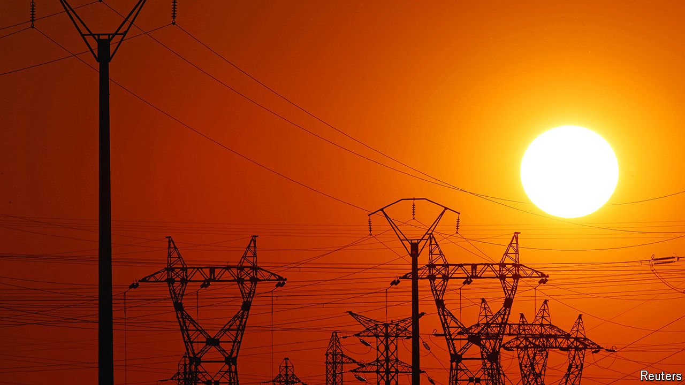

###### Gridlock

# Europe faces an unusual problem: ultra-cheap energy 

##### The continent is failing to adapt to a renewables boom 

 

> Jun 20th 2024 

Owing to the rapid spread of solar power, Spanish energy is increasingly cheap. Between 11am and 7pm, the sunniest hours in a sunny country, prices often loiter near zero on wholesale markets (see chart). Even in Germany, which by no reasonable definition is a sunny country, but which has plenty of wind, wholesale prices were negative in 301 of the 8,760 tradable hours last year.

As solar panels and wind farms take over Europe, the question facing the continent’s policymakers is what to do with all the power they produce. Ultra-low—and indeed negative—prices suggest that it is not being put to good use at present, reflecting failures in both infrastructure and regulation. There are three main ways that firms and regulators could establish a more efficient market: sending energy to areas where there is no surplus, shifting demand to hours when energy is plentiful, and storing energy as electricity, fuel or heat.

