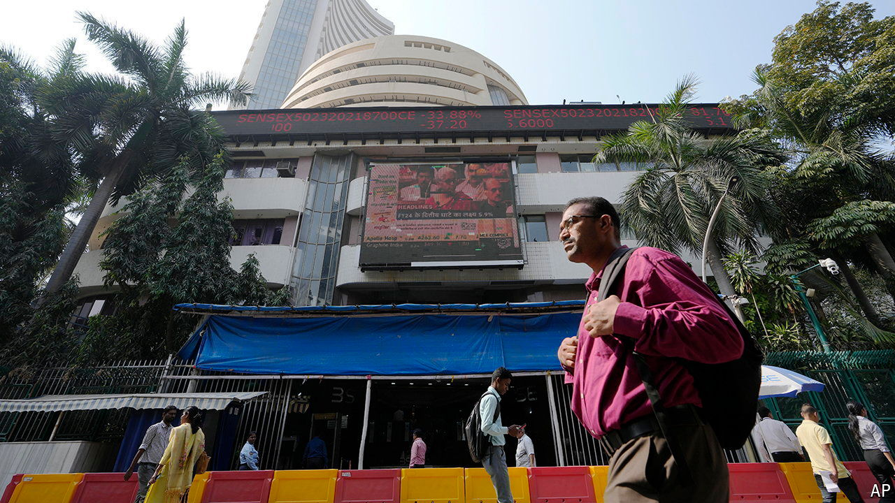

###### Leviathan bound

# Indian state capitalism looks to be in trouble 

##### A weakened Narendra Modi is bad news for investors in government-controlled firms 

 

> Jun 20th 2024 

India’s stockmarket swooned upon the news that Narendra Modi, the country’s business-friendly prime minister, would return to power diminished and in a coalition after a recent general election. One benchmark, though, fell especially sharply and has yet to recover: the Bombay Stock Exchange’s index for Public Sector Undertakings (BSE PSU). It comprises 56 companies that have some private ownership but remain mostly owned, and entirely controlled, by the state.

This curious corporate structure dates back to India’s independence from Britain in 1947 and the country’s subsequent embrace of state planning, which was extended to encompass, in the Marxist-infused language of the time, “the commanding heights of the economy”. This came to include companies in everything from aviation and insurance to artificial limbs and banking. Only when India’s economy opened to the world in the 1990s did the approach change. Since then, politicians have tried, with varying degrees of enthusiasm, to put firms under private control. 

