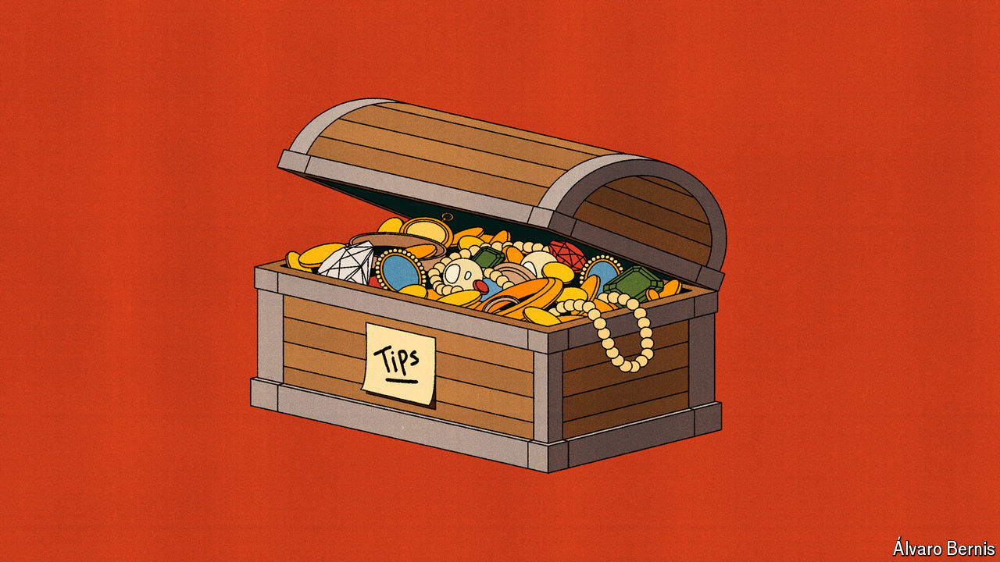

###### Free exchange

# Is America approaching peak tip? 

##### The country’s gratuity madness may soon calm, so long as Donald Trump does not get his way 

 

> Jun 20th 2024 

Things are big in America. That is true of houses, cars and food portions. Perhaps most shocking of all is the size of tips. In much of the rest of the world, gratuities are a small gesture for good service. In American restaurants they are . And they are becoming more generous and more common. For workers who already get them, tips are growing; for those who do not get them, tips may be coming their way. But this cannot go on for ever. Look closer at the tipflation gripping America and a surprising conclusion emerges: the country may be approaching peak tip.

As with so much these days, Donald Trump has a hand in this. At a recent rally in Las Vegas, he casually inserted a radical proposal about halfway through his speech. “For those hotel workers and people that get tips, you’re going to be very happy. Because when I get to office we are going to not charge taxes on tips,” he said. It was, he argued, only right to stop the government from going after the earnings of people who provide good service.

