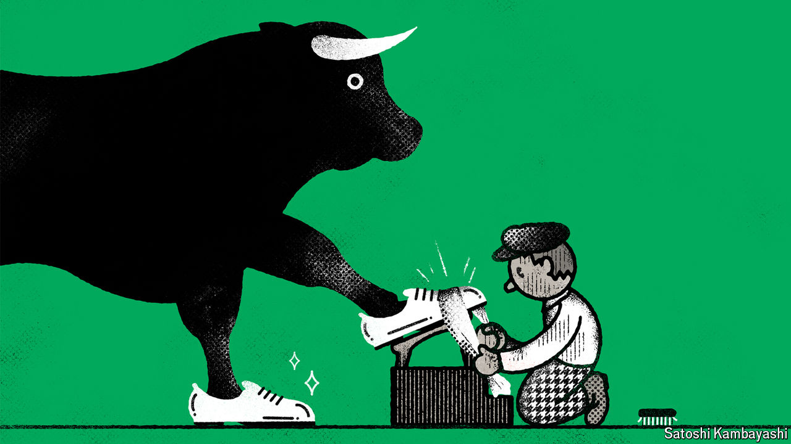

###### Buttonwood

# Think Nvidia looks dear? American shares could get pricier still 

##### Investors are willing to follow whichever narrative paints the rosiest picture 

 

> Jun 19th 2024 

How can you tell it is time to get out of the market? In 1929 Joseph Kennedy, an American businessman and politician, supposedly realised the party was over upon hearing a shoeshine boy dispensing stock tips. In 2000 the exit doors beckoned after 17 “dotcom” firms paid millions of dollars each for brief advertising slots during the Super Bowl, an American-football extravaganza.

And so to a sell signal fit for 2024: Keith Gill is back on social media. Mr Gill was an architect of the  of 2021, exhorting retail traders to buy shares in GameStop, a struggling chain of video-game shops. After a three-year absence he is posting once again, now apparently in possession of a stake in the firm worth a few hundred million dollars. GameStop’s share price has resumed a gut-churning roller-coaster ride and is up by more than 40% since Mr Gill’s return; the ailing company has made use of the excitement to issue some $3bn-worth of new shares. If you are looking for signs of speculative excess in markets, this is Exhibit A.

