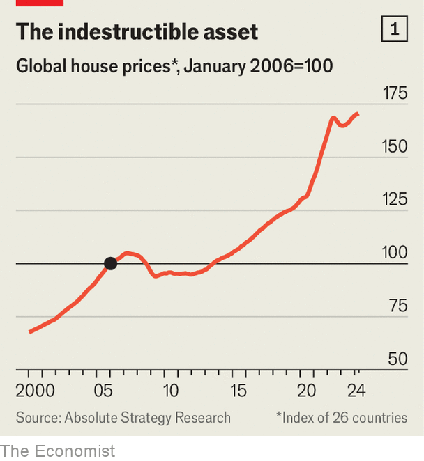

###### The great escape

# Why house prices are surging once again 

##### In America, Australia and parts of Europe, property markets have shrugged off higher interest rates 

 

> Jun 16th 2024 

Is a fresh housing boom under way? In April a house-price index for the world, excluding , rose by more than 3% year on year (see chart 1 ).  are 6.5% higher than a year ago, Australian ones have increased by 5% and Portuguese ones are soaring. In other countries, the market looks surprisingly strong given years of high interest rates (see chart 2). 

 


