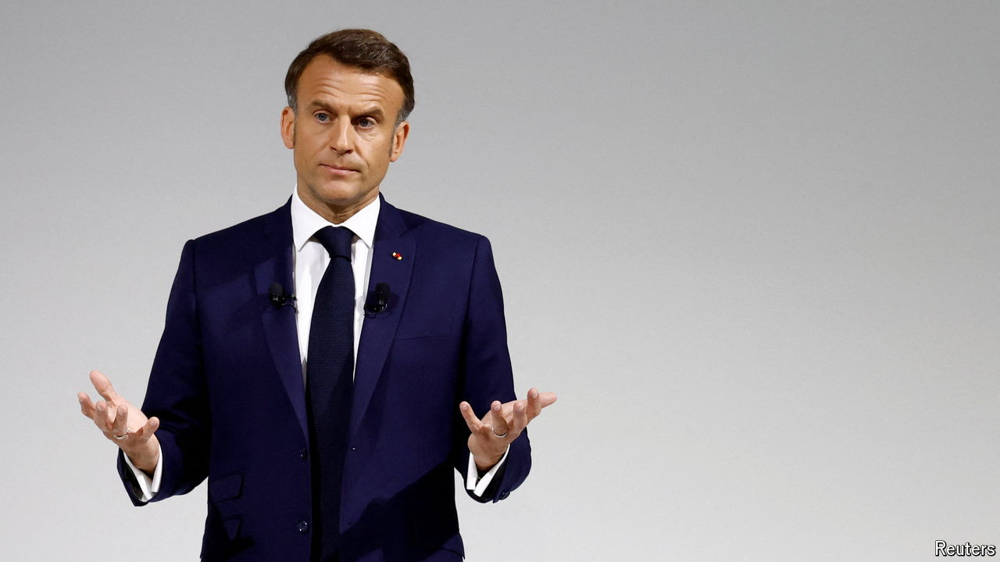

###### French peril

# Emmanuel Macron’s project of reform is at risk 

##### A snap election in France reveals the flimsiness of his legacy 

 

> Jun 20th 2024 

IT may NOT measure up to Napoleon’s march on Moscow in 1812, but Emmanuel Macron’s decision to call a parliamentary election this month is looking like one of the most self-destructive gambles by a French leader in modern times. After seven years under his centrist government, voters’ judgment threatens to be severe. It may well plunge France into a political, and perhaps even economic, crisis. One victim would be Mr Macron’s own project of reform.

The signs so far are ominous. The stockmarket has fallen by 4% since he made his announcement on June 9th, the night of his party’s drubbing in the European Parliament elections at the hands of Marine Le Pen’s National Rally. Share prices in France’s three big banks are down by almost 10%. Bond spreads are widening. Euro-elections tend to be a protest vote, not a reflection of how people will express themselves when choosing their national parliament. This time, however, their anger now has barely a week left to dissipate and the polls show no sign that it will.

