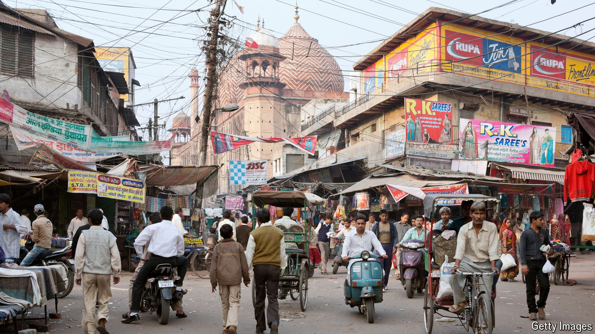

###### Power and politics in India

# India should liberate its cities and create more states 

##### It doesn’t need more government. It needs more governments 

 

> Jun 20th 2024 

In his first decade in office Narendra Modi used centralisation to help modernise the country. His ideal is a strong leader, with a national mandate and a majority in Parliament, who can direct the central government to force through changes across a huge country. Election results on June 4th cast doubts on that approach because Mr Modi’s party lost its majority and now relies on allies to rule. Centralisation appears to have reached its limit. That means it is worth considering the alternative: delegating power by creating more independently run cities and even more states.

The opening line of India’s constitution declares that the country “shall be a union of states”. After independence in 1947, princely realms were folded into new states, residual colonial territory annexed, and borders reorganised along linguistic lines. The system continues to adapt. Three new states were born in 2000. , the newest, turned ten this month. Today, India’s 28 states are powerful. They employ more people than local and central governments put together. And they are constitutionally responsible, or jointly responsible, for most basic functions, including health care, education, law and order, agriculture and the supply of welfare.

