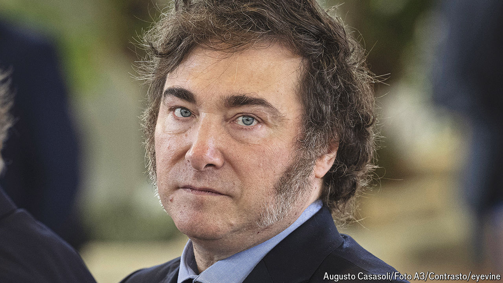

###### Raising Argentina

# Javier Milei’s next move could make his presidency—or break it 

##### Radical experiments with the currency could spell disaster 

 

> Jun 19th 2024 

WHEN ARGENTINA’S president, Javier Milei, donned his leather jacket and belted out rock songs to a stadium last month he cut an eccentric figure. And when he insults his country’s Congress (“a nest of rats”), the governor of Buenos Aires province (“a communist dwarf”) and Spain’s prime minister (“the laughing stock of Europe”), he comes across as just another boorish populist. Both characterisations have a grain of truth. Even so, by most economic measures Mr Milei is . 

In December, as he took office, Argentina’s economy was a tangle of rampant inflation and unsustainable price controls. To clean up, Mr Milei slashed spending. The central bank stopped printing money to finance the deficit. As a result, Argentina has had fiscal surpluses for five months in a row. Inflation spiked after a sharp devaluation, but has since fallen to a monthly rate of 4.2% in May, the lowest in over two years. 

