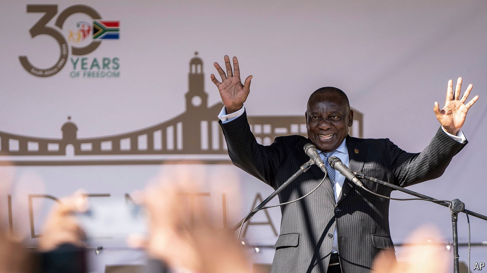

###### The rainbow nation’s election

# A remarkable new era begins in South Africa 

##### A national unity government can save democracy and the economy 

 

> Jun 14th 2024 


DESMOND TUTU once wrote that “we in South Africa…sell ourselves short.” In a country with many problems it is easy to forget its “remarkable achievements”, argued the late Nobel peace laureate. He felt that the world had much to learn from the largely peaceful transition to democracy in 1994; the Truth and Reconciliation Commission he chaired that shed light on the darkness of apartheid; and the forgiveness of ordinary black people scarred by decades of white rule. 

