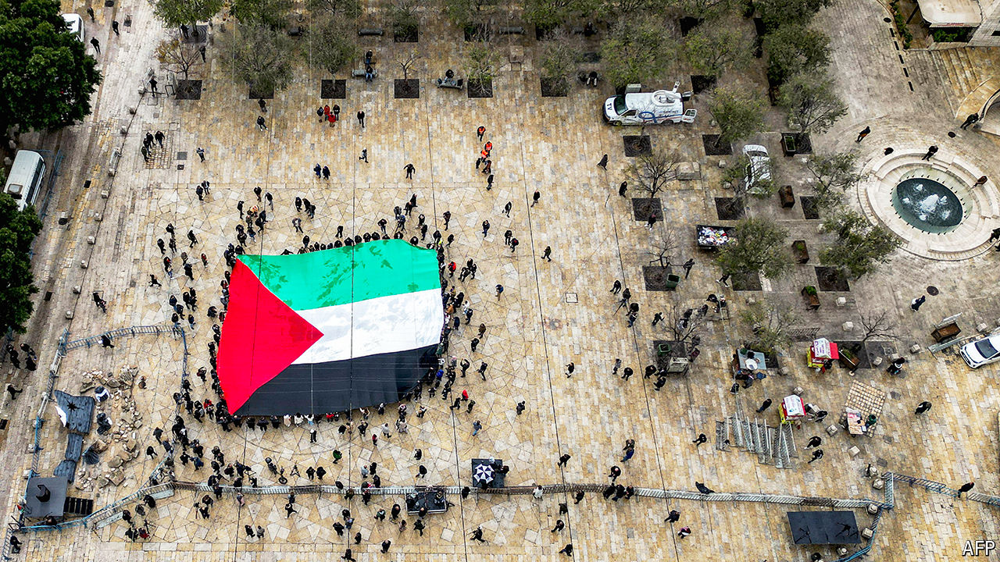

###### From chaos to country

# Is a Palestinian state a fantasy? 

##### Amid war in Gaza, the prospect is at once more relevant than ever and more distant 

 

> Jun 18th 2024 

IN THE diplomacy around the forever war between Israel and the Palestinians, it is customary to describe a Palestinian state as a necessity. Consider the latest Gaza , backed by America and all the other countries on the UN’s 15-strong Security Council bar Russia, which abstained. It outlines the global community’s “unwavering” commitment to a two-state solution “where two democratic states, Israel and Palestine, live side by side in peace”. It also insists that Gaza must be unified with the West Bank under the authority of the Palestinian Authority (PA). Most countries believe that Palestine should be recognised as a  immediately, before any peace deal is struck between Israel and the Palestinians. On May 10th 143 countries at the UN supported this idea. On May 28th they were joined by Ireland, Norway and Spain.

Some visions of this new state are inspiring. Palestine Emerging, a study by 100 experts released in April, foresees Gaza and the West Bank by 2050 as a single entity of 13m people, up from around 5m today, connected by a railway, replete with nature reserves and an airport. The devastation in Gaza creates a clean slate on which a new city will be built, with a seaport on an island linked to the mainland by a causeway. Palestine would prosper as a trading entrepot, its currency pegged to the dollar, underwritten by the rich Gulf states. Yet when you look away from such hopeful blueprints, the gap between the dream and reality is crushingly large. 

