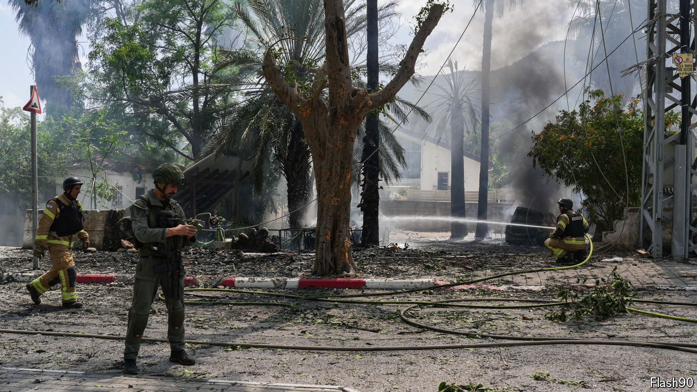

###### War in the Middle East

# Israel’s northern border is ablaze 

##### Can it fight Hamas and Hizbullah simultaneously? 

 

> Jun 17th 2024 

RED BANNERS that hang across bridges above the main roads leading north in Israel contain one word: “Abandoned”. It is repeated by the few residents remaining in the near-deserted towns and villages near the border, which have been under fire for eight months from Hizbullah, the Iran-backed movement that controls much of . It is also an accusation levelled at the government of Binyamin Netanyahu, Israel’s prime minister, which has failed to find a way to stop the barrage of missiles and drones that Hizbullah began firing on October 8th, the day after Hamas’s attack on Israel. Hassan Nasrallah, the leader of Hizbullah, recently vowed to continue the attacks, insisting that his group is a “support front” for Hamas.

“We’re like ducks in Nasrallah’s shooting-range,” says Gidi Sayada, a winemaker from Safsufa, a village that has not been evacuated. “My daughters have been sleeping in the safe-room of our house for the past eight months.” Hizbullah has shelled mainly targets close by the border and military bases. Israel has responded with targeted strikes on Hizbullah people, in some cases deep inside Lebanon. 

