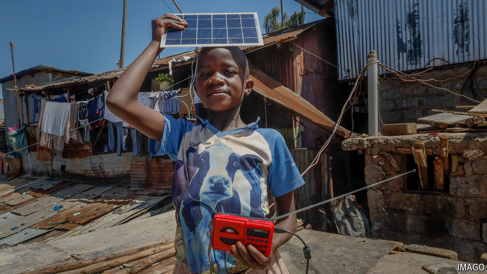

###### The light continent

# Private firms are driving a revolution in solar power in Africa 

##### Unreliable grids and falling costs are persuading companies to go off-grid 

 

> Jun 18th 2024 

African poverty is partly a consequence of energy poverty. In every other continent the vast majority of people have access to electricity. In Africa 600m people, 43% of the total, cannot readily light their homes or charge their phones. And those who nominally have grid electricity find it as reliable as a Scottish summer. More than three-quarters of African firms experience outages; two-fifths say electricity is the main constraint on their business. If other sub-Saharan African countries had enjoyed power as reliable as South Africa’s from 1995 to 2007, then the continent’s rate of real GDP growth per person would have been two percentage points higher, more than doubling the actual rate, according to one academic paper. Since then South Africa has also had erratic electricity. So-called “load-shedding” is probably the main reason why the economy has shrunk in four of the past eight quarters.

Solar power is increasingly seen as the solution. Last year Africa installed a record amount of photovoltaic (PV) capacity (though this still made up just 1% of the total added worldwide), notes the African Solar Industry Association (AFSIA), a trade group. Globally most solar PV is built by utilities, but in Africa 65% of new capacity over the past two years has come from large firms contracting directly with developers. These deals are part of a decentralised revolution that could be of huge benefit to African economies. 

