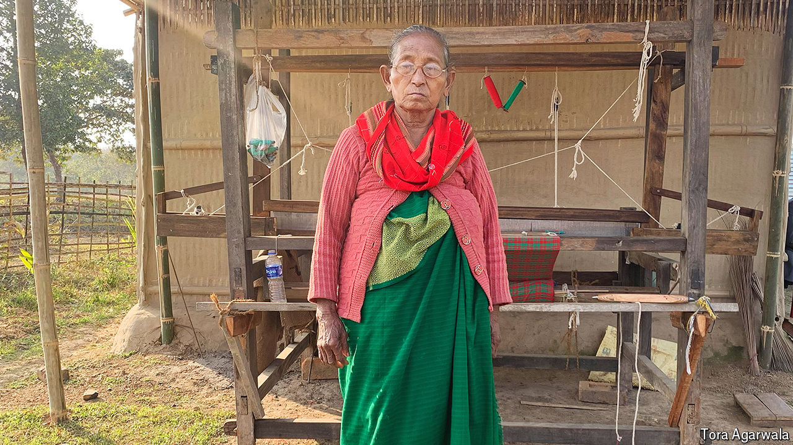

###### No witches in this world

# Birubala Rabha fought to end the stigmatisation of women 

##### The intrepid campaigner against witch-hunting died on May 13th, aged 75 

 

> Jun 20th 2024 

Slowly, limping and swaying with a sort of palsy, a young woman was led across the grass. Her name was Jarmila. She was 27, but had the body of a wasted child. Rain was pouring down; two women sheltered her with an umbrella. She had come to see Birubala Rabha because her sister-in-law beat her, and called her a witch. But all she really wanted was a room of her own in her brother’s house. Inside the hall where Birubala was she went to sit alone, a child-woman with a reedy voice and huge pleading eyes. But Birubala made a compromise between her and her brother. At the end Jarmila crumpled to the ground, crying, to seek her brother’s blessing. He had agreed that he would give her a room and never call her a witch again. As he left, he touched the feet of Birubala and, with a , thanked her.

Those feet were hard with constant travelling on unmade hill roads between the villages of Assam. Birubala was no more than a peasant herself, a tribal woman, simple and uneducated beyond class five; a farmer’s daughter, married at 15, who had grown crops and reared poultry to bring in little bits of money, as most did in this remote north-eastern corner. Her house, like theirs, had a tin roof and woven bamboo walls, with little furniture except her mosquito-netted bed and a tin trunk for papers. Her dialect was so particular to her home village, Thakurbila, that other Assamese struggled to understand it. But one hateful word had motivated her life and driven her travels: , a witch. 

