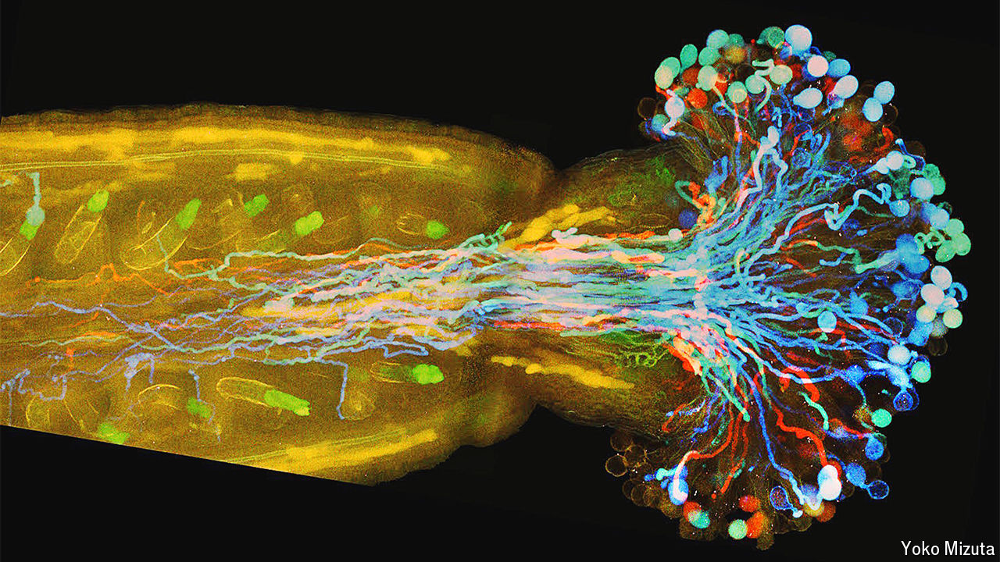

###### Flower power

# A flower’s female sex organs can speed up fertilisation 

##### They can also stop it from happening 

 

> Jun 20th 2024 

ANY biologically aware parent who has started talking about the birds and the bees will have realised halfway through that what they are really discussing is flowers. Bees carry pollen grains from one plant to another, enabling fertilisation; birds digest and excrete the resulting seeds, allowing new blooms to grow.

The role that flowers themselves play in their own reproduction, however, remains imperfectly understood. In a new paper published recently in , Mizuta Yoko at Nagoya University and her colleagues unveiled the secrets of this process with unprecedented detail. Among the revelations that arose from her 13-year-long investigation was the degree of control that a flower’s female sex organs have over the fertilisation process. Not only do they have the power to attract male reproductive cells, but they can also repel them once fertilisation has begun.

