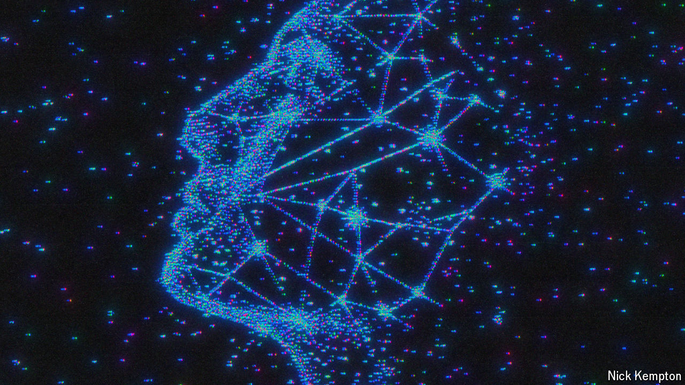

###### Paint by numbers

# How physics can improve image-generating AI 

##### The laws governing electromagnetism and even the weak nuclear force could be worth mimicking 

 

> Jun 20th 2024 

TODAY’S BEST image-generating artificial-intelligence (AI) models are remarkable. Ask OpenAI’s DALL-E 3, or its counterparts Midjourney and Stable Diffusion, to draw a penguin sipping on a vodka martini on the French Riviera and they will do so with aplomb. Ask them to replicate it in the style of Rembrandt or Caravaggio and they will speedily oblige.

These abilities all depend on a family of physics-inspired algorithms known as diffusion models. For now, they reign supreme. But that may not always be the case. A team of physicists and computer scientists at the Massachusetts Institute of Technology (MIT) has been taking inspiration from the laws of nature to come up with a series of increasingly sophisticated algorithms that can generate higher-quality images faster, and with smaller training data sets, than diffusion models.

