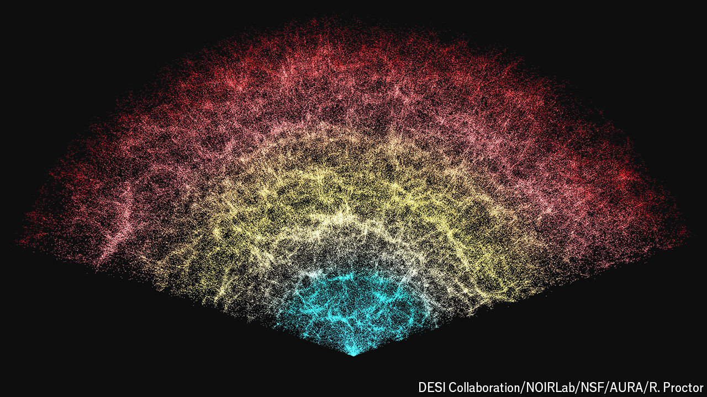

###### Dark secrets

# The dominant model of the universe is creaking 

##### Dark energy could break it apart 

 

> Jun 19th 2024 

IN ARIZONA, AT Kitt Peak National Observatory, a telescope has spent three years building a three-dimensional map of the heavens. In examining the light from tens of millions of galaxies, the Dark Energy Spectroscopic Instrument (DESI) may have found something astounding.

DESI, as its name suggests, is a tool to investigate the nature of dark energy, a mysterious entity that accounts for 68% of everything in the universe and which pushes space apart in a repulsive version of gravity. Though they do not know what it is, scientists have hitherto assumed that the density of dark energy has been the same since the start of the universe, 13.7bn years ago. But DESI’s initial results suggest that this assumption may have been wrong. Perhaps, say DESI’s scientists, the density has been changing over time. “It’s so bizarre,” says Dragan Huterer from the University of Michigan, who was involved with the work. If the findings prove true, it would catapult cosmology into a crisis.

